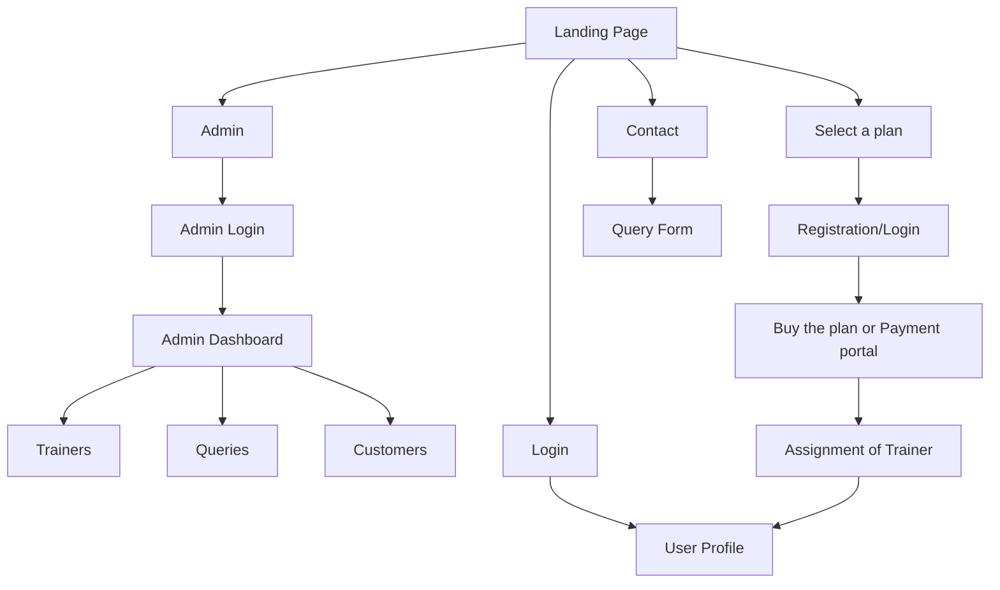

# Fitness-Center-Webpp


Written with :
- Frontend: `Next.js, React, Mantine, SWR, Javascript, TypeScript`
- Backend: `Fastify, Prisma, PostgreSQL (Supabase), TypeScript`

## To Run the Project
- Clone the project
- run `npm install` command in the project ROOT folder
- then create a `.env` file inside the api folder and create the necessary variables as show in the below format
- Run the commands from the root folder itself (Note we are using `NPM Workspaces` here, see the `/package.json`
  - `npm run dev:client` for starting the frontend server at http://localhost:3000
  - `npm run dev:api` for starting the API

### .env file
```env
DATABASE_URL = "postgres://........" # Your postgresSQL connection string, THIS IS IMPORTANT. Maybe use the Supabase for it just like we did
ADMIN_NUM = 123456 # This shall be your admin phone number or user id. Note its a number
ADMIN_PASSWORD = "99999" # self-explantory
```



